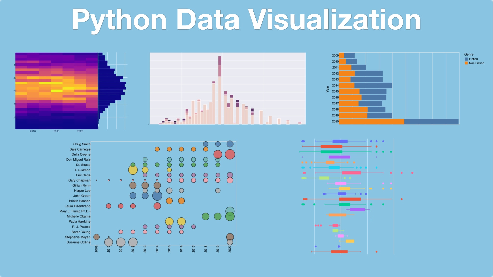

# Python Data Visualization course
Code and examples from our [**Python Data Visualization course**](https://training.talkpython.fm/courses/python-data-visualization).

Have you ever been confused by all the different python plotting libraries? Have you tried to make a "simple" plot and gotten stuck and been unable to move forward? Do you want to make sophisticated, interactive data visualizations in python? If you answer yes, to any of these questions, then this course is for you.

## What's this course about and how is it different?

The python data visualization landscape has many different libraries. They are all powerful and useful but it can be confusing to determine what works best for you. This course is unique because you will learn about many of the most popular python visualization libraries. You will start by learning how to use each library to build simple visualizations. You will also explore more complex usage and identify the scenarios where each library shines.

By the end of this course, you will have a basic working knowledge of how to visualize data in python using multiple libraries. You will also learn which library is best for you and your coding style. Along the way, you'll learn general visualization concepts to make your plots more effective.

In addition to the overview material, we will cover some of the more complex, interactive visualization dashboard technologies.

## What topics are covered

In this course, you will:

- Review the python visualization landscape
- Explore core visualization concepts
- Use matplotlib to build and customize visualizations
- Build and customize simple plots with pandas
- Learn about seaborn and use it for statistical visualizations
- Create visualizations using Altair
- Generate interactive plots using the Plotly library
- Design interactive dashboards using Streamlit
- Construct highly custom and flexible dashboards using Plotly's Dash framework

View the full [**course outline**](https://training.talkpython.fm/courses/python-data-visualization#course_outline).

## Who is this course for?

Developers and Data Analysts that have some experience with python but have not developed a competency in a python visualization library. This course is also helpful for those that feel restricted by their current plotting tools and wish to explore other options.

**Note**: All software used during this course, including editors, Python language, etc., are 100% free and open source. You won't have to buy anything to take the course.

## Take the course

Data sciense is one of the hottest topic of the year and data visualization is a core skillset needed to properly communicate your results and discoveries. **Take this course** to get good at a wide variety of modern Python-based visualization libraries.
